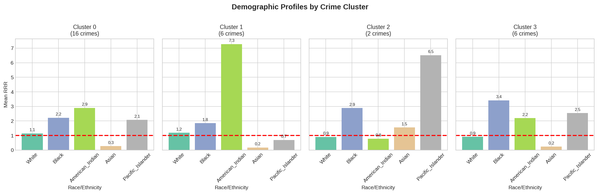
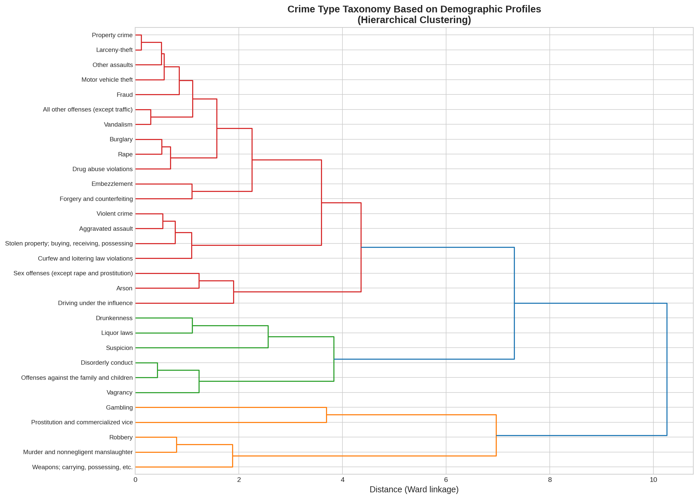

# Arrest Demographics Disparity Analysis

This project analyzes 2019 FBI arrest data to identify racial disparities in arrest rates relative to the US population. It uses Relative Risk Ratios (RRR) to quantify disproportionate representation and various clustering algorithms (K-Medoids, GMM, Hierarchical) to categorize crimes based on their demographic arrest profiles.

## Key Findings (2019 Data)

The analysis of 2019 FBI UCR data reveals significant racial disparities in specific offense categories.

### Top 5 Disparities by Relative Risk Ratio (RRR)
| Rank | Offense | Most Over-represented Group | RRR |
|------|---------|-----------------------------|-----|
| 1 | Drunkenness | American Indian | **12.27** |
| 2 | Gambling | Pacific Islander | **10.41** |
| 3 | Liquor laws | American Indian | **7.56** |
| 4 | Offenses against family/children | American Indian | **7.13** |
| 5 | Disorderly conduct | American Indian | **6.90** |

*Note: RRR > 1.0 indicates over-representation. An RRR of 12.27 means the group is arrested at a rate 12x higher than their population share would predict.*

### Crime Clusters
The analysis identified 4 distinct clusters of crimes based on demographic profiles:

*   **Cluster 0 (16 crimes)**: Crimes with moderate American Indian over-representation (RRR ~2.9). Includes *Rape, Aggravated Assault, Burglary*.
*   **Cluster 1 (6 crimes)**: High American Indian disparity (RRR ~7.3). Includes *Liquor laws, Drunkenness, Offenses against family*.
*   **Cluster 2 (2 crimes)**: High Pacific Islander disparity (RRR ~6.5). Includes *Gambling, Prostitution*.
### One-Hot Encoding vs. RRR Features
We use RRR values directly as features for clustering rather than raw counts or one-hot encoding. This ensures we are clustering based on the *pattern of disparity* rather than volume of arrests.

## Visualizations

### Disparity Heatmap
Log-scale Relative Risk Ratios showing over/under-representation. Red indicates high over-representation.


### Cluster Profiles
Mean RRR values for each demographic group within each identified cluster.


### Crime Taxonomy (Dendrogram)
Hierarchical clustering showing relationships between different offense types based on demographic arrest patterns.



```
Arrest_Demographics_Disparity/
├── data/
│   ├── raw/            # Original FBI Excel and Census data
│   └── processed/      # Cleaned DataFrames (if saved)
├── outputs/
│   ├── figures/        # Generated plots (heatmaps, dendrograms)
│   └── reports/        # Markdown analysis reports
├── src/
│   ├── data_acquisition.py  # Usage of requests to fetch data
│   ├── data_processing.py   # Modin/Pandas data cleaning
│   ├── rrr_analysis.py      # Statistical calculations
│   ├── clustering.py        # K-Medoids, GMM, Hierarchical clustering
│   ├── visualization.py     # Plot generation code
│   └── main.py              # Execution pipeline
├── tests/              # Unit tests
└── pyproject.toml      # Project configuration and dependencies
```

## Methodology

1.  **Metric**: Relative Risk Ratio (RRR)
    
    $$
    RRR = \frac{\% \text{ of Arrests for Group } X}{\% \text{ of Population for Group } X}
    $$
2.  **Clustering**:
    *   **K-Medoids (PAM)**: Robust clustering using actual data points as centers.
    *   **GMM**: Probabilistic clustering allowing for soft assignments.
    *   **Hierarchical**: Taxonomy generation visualized via dendrogram.
3.  **Technology**:
    *   **Python 3.12**
    *   **Modin[ray]**: Distributed DataFrame processing for performance.
    *   **Scikit-Learn**: Clustering algorithms.

## Quick Start

1.  **Install dependencies**:
    ```bash
    uv sync
    ```

2.  **Run the analysis**:
    ```bash
    uv run python src/main.py
    ```
    This will download data, run calculations, and generate figures in `outputs/figures/`.

3.  **Run tests**:
    ```bash
    uv run pytest
    ```

## Outputs

After running the pipeline, check `outputs/figures/` for:
*   `rrr_disparity_heatmap.png`: Comprehensive view of disparities.
*   `crime_dendrogram.png`: Hierarchical relationships between crimes.
*   `cluster_profiles.png`: Bar charts showing the demographic signature of each cluster.
